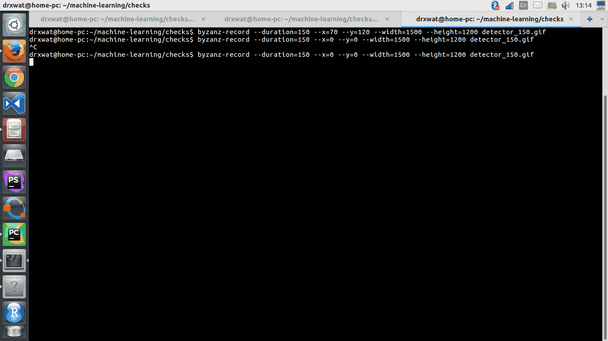

# OCR
Contains tools for object detection and recognition. Based on opencv3 and neural networks.

## Installation
 1. install pip requirenments 
 2. opencv 3.1.0 from source
 
## Demo

### Dirty detector and model

### With pretty good detector and week classification model

